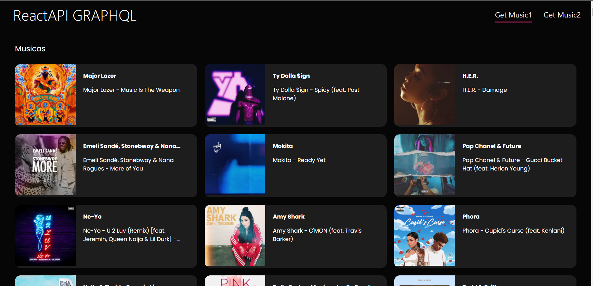
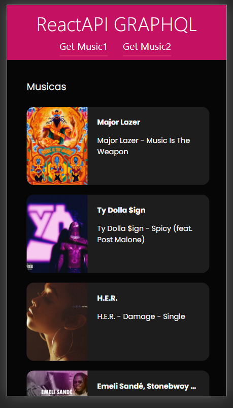

# API_GraphQl y MongoDB

 
 
Utilizando como Framework Express.js y Babel para transpilar código moderno de Javascript.

Pasos:
<ul>
    <li>Se necesita el archivo .env con la URI de MONGODB</li>
    <li>Instalar <a href="https://www.mongodb.com">MongoDB</a> o usar <a href="https://www.mongodb.com/cloud/atlas">MongoAtlas</a></li>
    <li>Ejecutar en cmd: <b>npm i</b></li>
    <li>Ejecutar en cmd: <b>npm start</b></li>
    <li>El Frontend esta en el siguiente <a href="https://github.com/BeatsBass/GraphQlReact">repositorio</a></li>
    <li>Ejecutar en cmd: <b>npm start</b> al Frontend</li>
</ul>